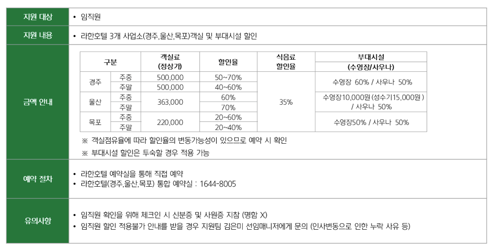
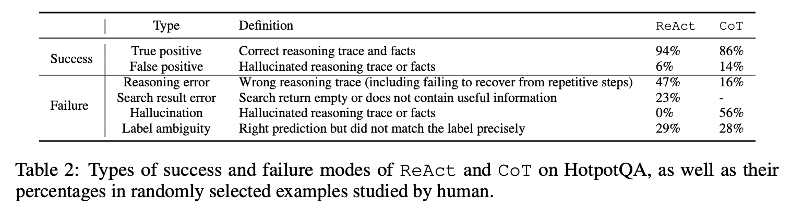
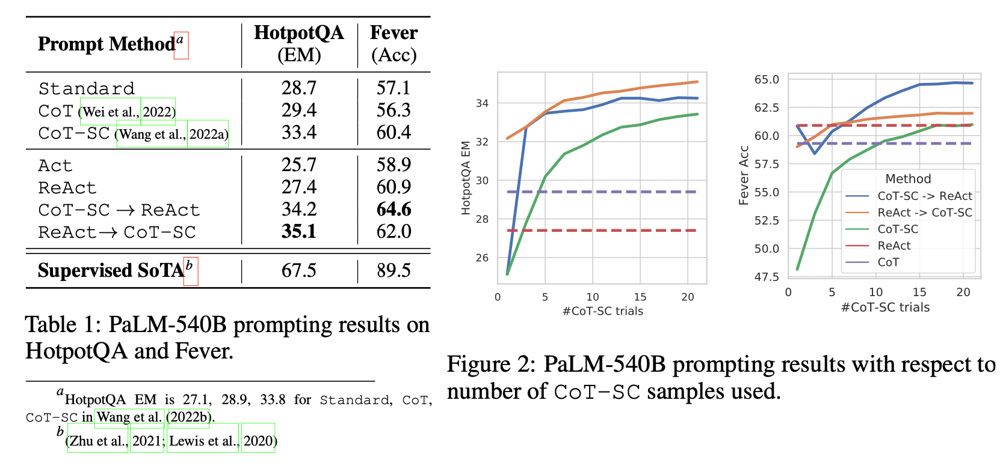

# Multi Modal OCR

## PDF to IMG

아래와 같이 PDF에서 각 페이지를 이미지로 저장합니다.

```python
import fitz
doc = fitz.open(pdf_path)
total = len(doc)
saved = []
zoom = dpi / 72  # 72 dpi is the PDF default
mat = fitz.Matrix(zoom, zoom)

for i, page in enumerate(doc, start=1):
    pix = page.get_pixmap(matrix=mat, alpha=False)
    filename = f"page_{i:03d}.png"
    out_path = os.path.join(output_dir, filename)
    pix.save(out_path)
    saved.append(out_path)
    print(f"  [{i}/{total}] Saved → {out_path}")

doc.close()
````


아래와 같이 실행하면 이미지를 추출할 수 있습니다.


```bash
python pdf2img/pdf2img.py contents/2017-NEC-Code.pdf
```

## Image to Text

아래와 같이 이미지를 읽어서 Base64로 변환한 후에 Multimodal LLM으로 text를 추출합니다. LLM 활용을 위해 markdown 형태로 저장합니다.

```python
def extract_one(image_path: Path) -> str:
    with open(image_path, "rb") as f:
        raw = f.read()
    b64 = _prepare_image_base64(raw)
    raw_text = _extract_text_with_llm(b64, LLM_PROMPT)
    return _parse_result(raw_text).strip()
```

이때 사용하는 prompt는 아래와 같습니다.

```python
LLM_PROMPT = (
    "페이지 내용을 Markdown 형식으로 변환합니다. 평문이 아니라 제목(#·##)·목록·강조·코드 블록 등 "
    "Markdown 문법을 적절히 써서 구조화해 주세요. 문장 단위로 읽기 쉽게 구분합니다. "
    "상단의 header와 하단의 footer는 출력에서 제외합니다. 상단 header는 주로 현재 페이지 제목이고, "
    "footer에는 페이지 번호 등이 있는데, 변환 결과에는 포함하지 않습니다.\n\n"
    "페이지에 그림·도표·사진·스크린샷·다이어그램·캡처 등 시각적 요소가 있으면, 그 이미지가 무엇을 보여주는지·"
    "본문과 어떤 관계인지·어떤 정보를 전달하는지를 빠짐없이 상세히 풀어서 서술합니다."
)
````

아래와 같이 Base64로 변환한 이미지를 Prompt와 함께 전달하여 text를 추출합니다.

```python
query = LLM_PROMPT

multimodal = _get_chat()
messages = [
    HumanMessage(
        content=[
            {
                "type": "image_url",
                "image_url": {"url": f"data:image/png;base64,{img_base64}"},
            },
            {"type": "text", "text": query},
        ]
    )
]

result = multimodal.invoke(messages)
extracted_text = result.content
```

이를 실행할때에는 아래와 같이 수행합니다.


```bash
python img2tet/img2txt.py contents/page_040.png
```

[추출한 이미지](./contents/page_040.png)에 대한 결과는 [추출된 Text](./contents/image_summary_4039b0fb54aa4bb8b46f48b4e219f0b3.md)와 같습니다.

## OCR 결과

### 표안의 표

표안의 표가 있는 경우는 대표적인 복잡한 OCR 케이스입니다. 이때 비어있는 항목이 있으면 RAG등에서 활용할 때에 적절한 값을 얻지 못할 수 있습니다.

[complex_parsing_hotel_info.png](./contents/complex_parsing_hotel_info.png)을 분석하면 아래와 같습니다.



이때의 결과는 아래와 같습니다. 표안의 표가 있는 복잡한 경우이지만 아래처럼 표가 적절히 분석되었습니다.


[example-table.png](./contents/example-table.png)에 대해 OCR을 수행합니다.


### Table

아래 Table의 경우에 왼쪽에 Success / Failure로 구분되어 있고 Capture이 밑에 있습니다. Caption으 함께 보지 않으면 Success/Failure의 의미를 파악하기 어려운 케이스입니다.



이때의 결과는 아래와 같습니다. Table 제목 아래에 Success / Failure가 구분되어 있으므로 이해하기 좋습니다. 


[example-table-and-image.png](./contents/example-table-and-image.png)에 대해 OCR을 수행합니다.

### 표과 이미지

아래와 같이 페이지에 표와 이미지가 같이 있는 경우에 표와 이미지를 구분하여 처리하는것은 매우 어려운 OCR 주제입니다.



이때의 Table 결과는 아래와 같습니다. Table에 별도로 결과를 주고 있습니다.


아래는 그림에 대한 OCR 결과입니다. 그림을 해석하여 풀어쓰므로써 LLM이 그림을 활용할 수 있도록 해줍니다.


